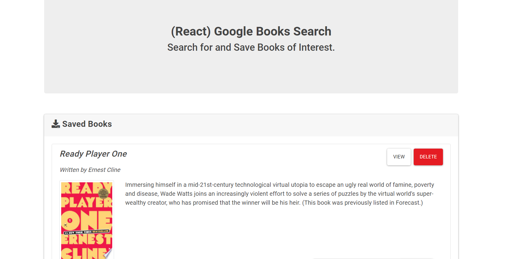

# googlebooks2

## Description 
to make a readme without the hassle
## Table of Contents
* [Installation](#installation)
* [Usage](#usage)
* [License](#license)
* [Contributing](#contributing)
* [Questions](#questions)
## Installation
This generator requires the user to install dependencies using the command "npm i" in their terminal. After installation to run the application, run "npm start" from your server.
## Usage 

## License
This repo is licenced under the MIT license.
## Contributing
2
## Questions
Please send any questions to my email: <aportera3@gmail.com>
## Links
https://reactgooglebooksap.herokuapp.com/
